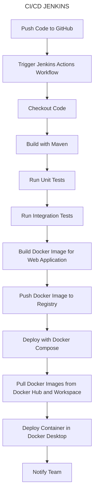

```mermaid
---
title : CI/CD JENKINS
---
graph TD
    A[Push Code to GitHub] --> B[Trigger Jenkins Actions Workflow]
    B --> C[Checkout Code]
    C --> D[Build with Maven]
    D --> E[Run Unit Tests]
    E --> F[Run Integration Tests]
    F --> G[Build Docker Image for Web Application] 
    G --> H[Push Docker Image to Registry]
    H --> I[Deploy with Docker Compose]
    I --> J[Pull Docker Images from Docker Hub and Workspace]
    J --> K[Deploy Container in Docker Desktop]
    K --> L[Notify Team]
```
